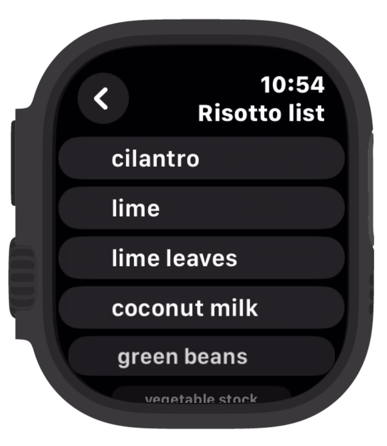

# WatchShopper

A simple and opinionated app to present your shopping list on your Apple Watch

## Goals

1. Easy to create a list and add list items from your iPhone.
2. Compact list items to show as many items on the watch screen as possible.
3. Complication support for quick navigation to the shopping list.
4. When items are checked off they are sent to the bottom of the list so you can focus on what remains.
5. Item checked status syncs between watch and phone

## Wish List

1. Make it easy to export a recipe's ingredients to a new or existing list
    - Automatically filter common ingredients like salt or oil?
    - When we should we omit measurements and units?
2. Group ingredients by grocery store section
3. Prompt auto-complete for common or recently used ingredients
4. Auto-launch recently created or edited list, bypassing list of lists

## Demo

Here is a screen recording of the watch app and the phone app in action.  The watch app is the star here for me.  The phone app isn't much to brag about, but it gets the job done.

## History

This app was originally created to work with the Pebble Watch, and to have the shopping lists backed by Evernote.  Later support for the Apple Watch was added.  Over the years, Evernote became harder and harder to work with, and the app code got old and creaky.  Finally I did a full rewrite using SwiftUI and included only Apple Watch support, since my Pebble watches had stopped functioning years ago.  I still miss the mechanical buttons, and don't care much for the touch screen.